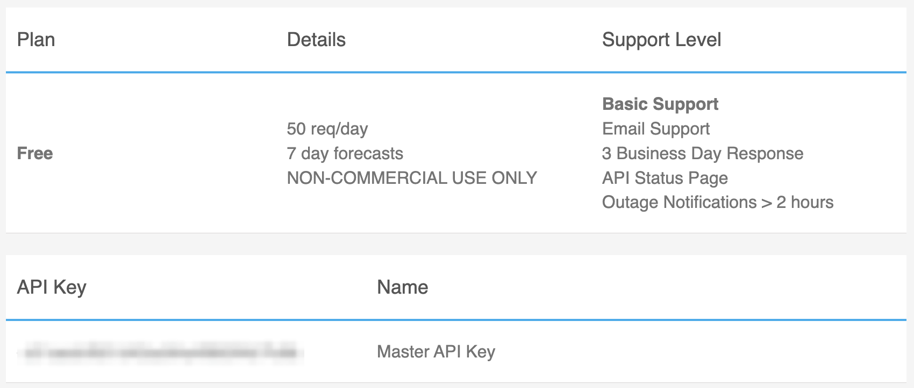
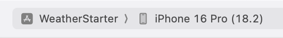
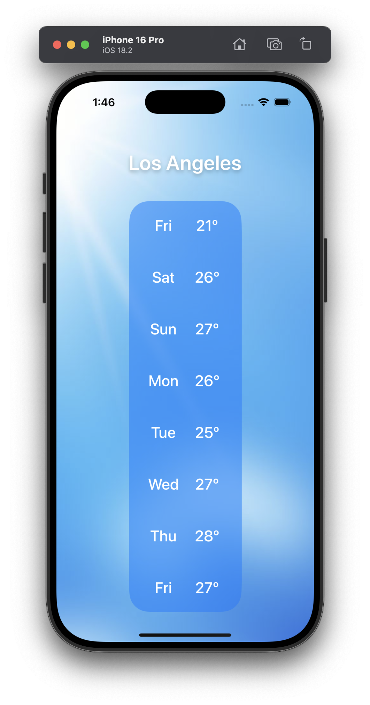

# Getting Started

We are going to be building a simple app that displays the current and daily weather for New York City. When we're done, this is what your app will look like:

## Pre-requisites
- Have an Apple computer (or Virtual Machine)
- Have Xcode installed

## Set-up

### 1. Download Xcode

First things first, make sure to download [Xcode](https://apps.apple.com/us/app/xcode/id497799835). This is the integrated development environment (IDE) that we will use to build our app.

### 2. Get your API key

We will be using the[ Weatherbit API](https://www.weatherbit.io/) to get forecast data. Make sure to create a free account and get your API key.

### 3. Download starter code

Download this Github repository to your computer and open the **starter** Xcode project (`WeatherStarter.xcodeproj`).

### 4. Run the app

Once the project is open, we're going to run the app in a simulator. To select a simulator device, press the device selector at the center top. For example, I have selected the iPhone 16 Pro simulator.

 
 

Next, we can press the play icon, on the top left, to run our starter app. Once the simulator is open you should see something like this:

 
 

Don't worry, during the lunch n' learn session we'll fix any UI that looks weird right now, and we'll be showing real live weather data for New York City.

### 5. [Optional] But very useful

Watch Apple's [SwiftUI Essentials](https://developer.apple.com/videos/play/wwdc2024/10150/) video.