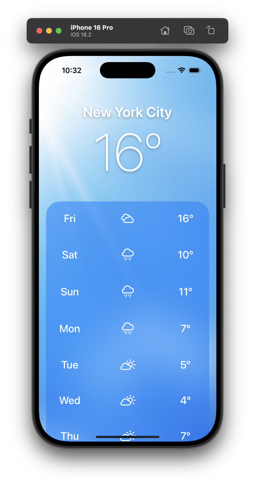

# NYU Professional Practicum Project
 
If you're a Tech MBA student...click [here](https://github.com/apatronl/NYU-PP/tree/main/App/WeatherStarter/README.md) to see starter project instructions.

# About the app

This project is a simple app that displays New York City's weather. It was created by [Alejandrina Patrón](https://www.linkedin.com/in/alejandrinapatron/) and [Julian Ozen](https://www.linkedin.com/in/julianozen/) to teach the basics of iOS app development to fellow Tech MBA students at NYU.

